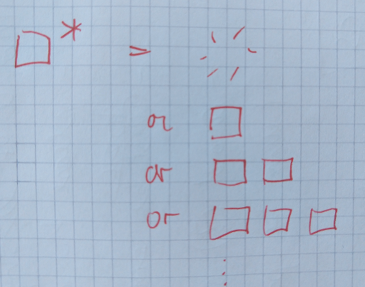

Kleene's Star

Computer are great at repetitive tasks. The most beautiful and concise
way of expressing this is Kleene's star: the symbol ```*```, which
stands for **zero or more repetitions**. For example, the letter
*capital A* followed by the Kleene Star means either ```{}``` (the
empty string), ```A``` (the string with one A), ```AA``` (the string
with two As), and even includes the string with infinitely many As.

A related, although slightly different concept, is a **wildcard
character** where the star itself *is* the placeholder, instead of a
sign of repetition.  So called "glob expressions" are common in
command line interfaces e.g. for listing all files that end with the
suffix txt: ```ls *.txt``` Wildcards are also common in daily life, a
prominent example is "blah blah".

Stephen Kleene was a mathematician studing symbolic logic.  In that
context there is a need to specify how well-formed expressions must be
structured. The use of the Kleene star enables for generic
specifications that are valid for an unbounded number of expressions.


