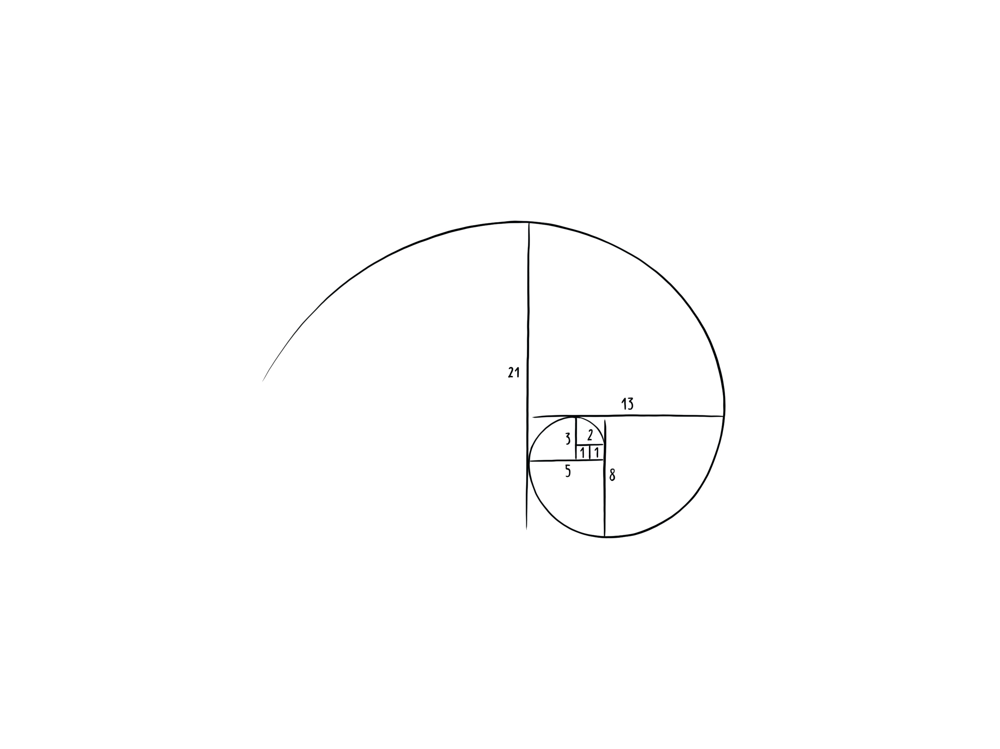

# Sometimes a problem can be solved by solving the same problem, but smaller.
## And smaller. 
### And smaller.

Imagine a problem that contains smaller instances of itself. Computing, for example, the 10th element from the famous Fibonacci sequence, will require you to sum up the 9th and 8th Fibonacci number. In order to obtain the 9th number, you will need to know the 8th and 7th element of the sequence. Knowing the 8th will require the 7th and 6th. And so on. Doing this is called *Recursion*.  
But when to stop? Recursion only works if there are certain smallest problems that can be solved *without* a smaller instance of the same problem, otherwise you’ll keep fragmenting into smaller problems forever. Continuing with the approach above will eventually lead you to computing the 1st and 2nd Fibonacci number, which are defined to be 0 and 1, respectively. Knowing these will allow you to go back all the way to the top and finally obtain the desired 10th Fibonacci number.

## Authors:
Moira Zuber, Tim Steindel, 2019-03-04
