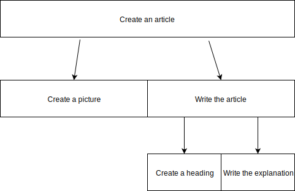

# If you can not solve the problem, try to break it in smaller parts

Divide and Conquer is a simple method: Divide a bigger problem into many subproblem and solve these. 
If this does not work just try the method again. 
We use it in sorting algorithm and it can be often used like in creating an article. 
The article can be divided  into a picture and a text. The text can be then divided further into a heading and the explanation.

## Authors:
Tim Steindel, Moira Zuber, 2019-03-04
