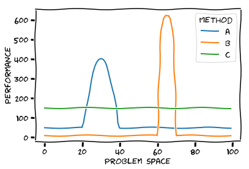

# There is no such thing as a free lunch
In Computer Science we have  a wide range of very different problems and accordingly many approaches to tackle them.
Whether that is in Search & Optimization, where we look for algorithms that find an optimal solution
or in Machine Learning, where we try to find a model that explains the available data best.
So it is only natural to think about methods and models that always provide us the best solution, regardless of the problem.

However, the 'No Free Lunch' theorems state, that no single method works better than any other for all possible problems.
Instead,  it is necessary to select the method based on the problem (or data) at hand.
That is, there is always a cost associated with selecting a method and unfortunately there is no such thing as a free lunch.

## Note
Image created using xkcd-style plotting of matplotlib:
https://matplotlib.org/xkcd/gallery.html

## Author
fat, 2019-03-05
