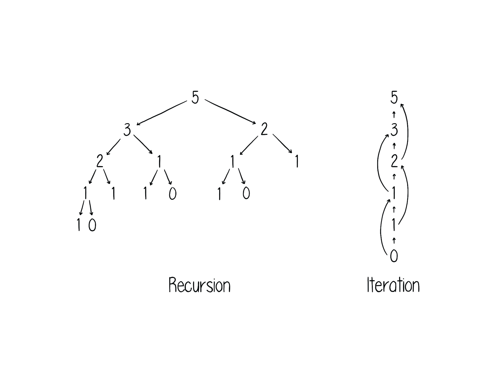

# Why solve any problem with recursion when iteration works just as well?

For every problem that can be solved with recursion, there exists an iterative solution too. Iteration will begin at the bottom of the problem and linearly work its way through to the solution, while recursion will start at the top, search its path down and then hand the obtained results all the way back. Sounds tedious, right? And truly, depending on the implementation, iteration often proves to be much more efficient than recursion. Then why use recursion at all?  

The beauty and usefulness of recursion lies in its intuitive nature. For many problems, examining the structure, the dependencies between the different pieces is a more natural approach than thinking about the entirety of the problem at once. While iteration needs every step towards the solution coded, recursion only requires a description of the problem, a *pattern*, then the surrounding scaffold that applies this pattern and obtains a solution will be created by the programming language itself.

## Author
Moira Zuber, 2019-03-28
