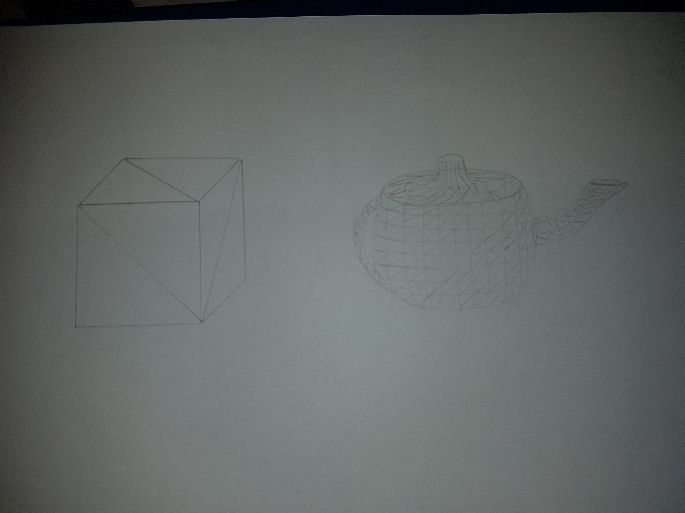

# World of triangles

The pictures seen in computer animated films or computer games  consist of many small triangles.
The shape of a figure in such an image comprises many points. To visualize a surface a set of those points are conected by lines. The mathematical figure which emerges through this procress is called polygon. The smallest polygone possible is the triangle, where only three points are connected.

The more triangles are used the more detailled a surface is. 
Where a simple object with smooth areas like a cube can be modeled by using only a few triangles, for a more complex structure like a teapot, many more triangles are required to represent its round shape.

 

 

## Author
Rebecca Dold, 2019-03-27
