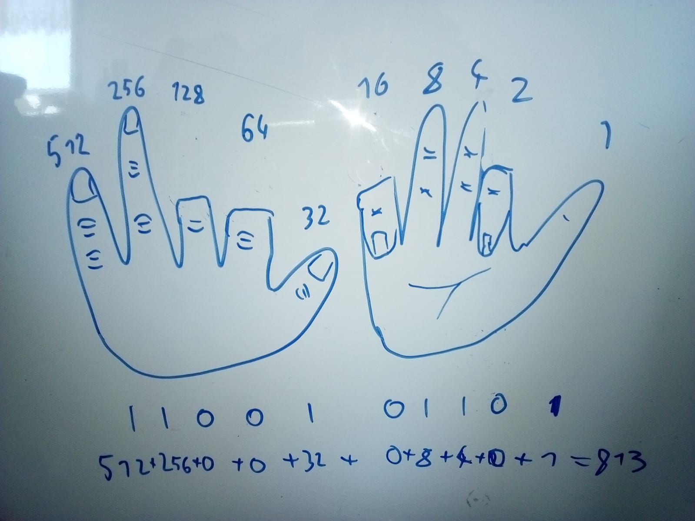

# Counting to more than ten with two hands
Normally you count with your fingers by stretching them out one after another. You don't care about witch ones are stretched out only the amount of them. Each of them is as significant as the other. By changing the significance in the way that the right thumb has significance 1 and the left neighbor has always a doubled significance we can get 1+2+4+8+16+32+64+128+256+512=1023 different numbers.
This is called binary counting and exactly the way a computer counts but with zeros and ones instead of bend and stretched fingers.

## Author
Simon Dold, 2019-03-28
