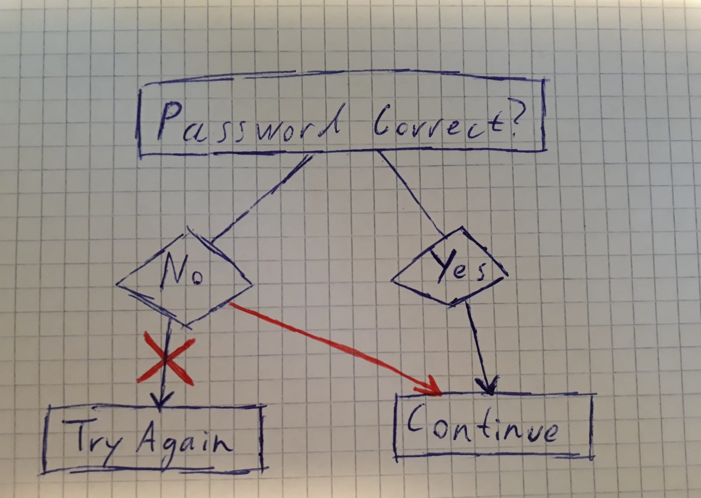

# Reverse Engineering

In general terms, *Reverse Engineering* describes the process of analyzing an existing object to figure out how it works and how it was made.
The same can be done for a computer program but instead of looking at screws and cogwheels we are looking at the machine instructions.
These are effectively the 0's and 1's that tell the computer what to do, also known as *Assembly language*.
This is much harder to understand than the code that was used to generate the program.
A skilled reverse engineer can still use this information to gain knowledge about the software. This can then be used to detect and exploit security flaws or even change the behavior of the software as a whole.

## Remark
Maybe explain graphic in text.
Maybe change "behavior" to "flow" to make graphic more clear.
Maybe use JMP instruction for graphic instead of flow diagramm.

## Attributes:
* Length of text :page_with_curl: short ( `:page_with_curl:` )
* Difficulty (to read) :mouse:  light ( `:mouse:` )
* Difficulty (to understand) :school_satchel:  easy ( `:school_satchel:` )
* Type of text :bowtie:  informative ( `:bowtie:` ) 
* Type of header :bulb:  informative ( `:bulb:` ) 

## Author:
Nils Bühlmann, 2019-03-27
