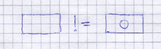

# Zero is not null 

The null value has a special meaning in computer science, it is used to declare that a value is not yet defined, known or exist. 
The speciality of null is, that altough it shows us that a value is missing, it is itself a value. So it is possible to compare two 
non existing values. For example null is useful for databases. Suppose we have a database of patient, 
it does make a different if a patient has not a disease (0) or is not yet diagnosed (null).

# Remark
I do not like the image, hopefully someone has a better idea. Also the notation of null (or NULL) and include NaN etc.? 

# Author
TS, 28.03.2019

# Attributes
   * Length of text: short
   * Difficulty (to read) light
   * Difficulty (to understand): easy
   * Type of text: informative
   * Type of header: b

