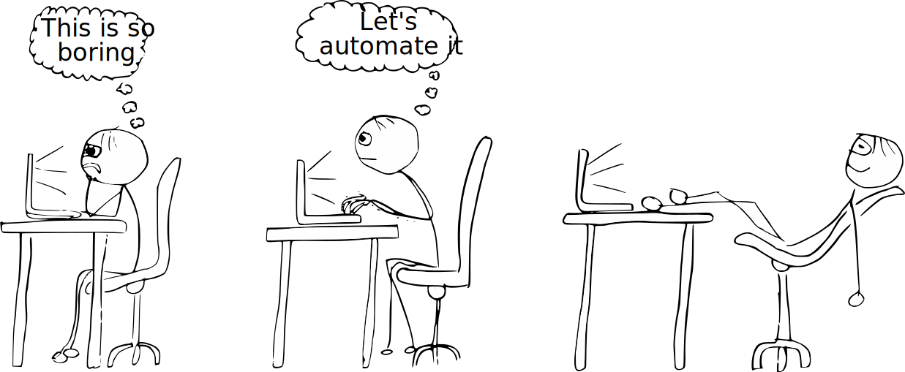

# Being lazy is a good thing

A lazy person is searching for ways to make things faster and more efficient. 

Instead of doing the same thing over and over again, a good computer scientist tries to automate the task. This not only improves the reliability, it also saves time on the long run. Furthermore, a good computer scientist is also lazy when it comes to writing code. Rather than solving a specific problem, a good programmer develops a generic solution that can be reused for similar problems. 

Good programmers are diligent to be lazy. Or with other words: They are strategically lazy. And that's a good thing.   

 

 

## Author
Marco Vogt, 2019-03-27

## Attributes
* :book:  long
* :mouse:  easy to read
* :school_satchel:  easy to understand
* :laughing:  funny text
* :boom:  catchy header