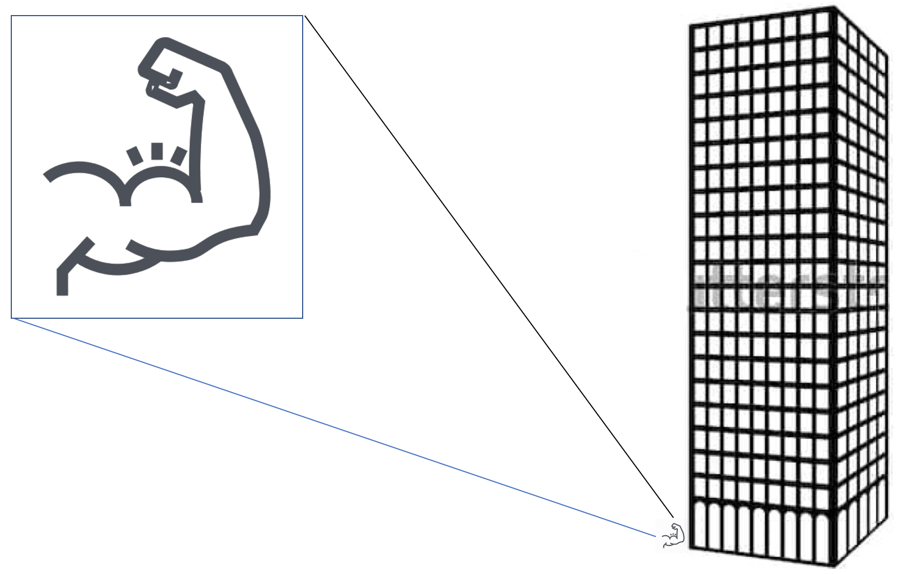

# "Brute Force" means you are weak

For some problems in Computer Science, it can be proven that there are
no "efficient" ways of solving them. The only resort then is **brute
force**. Brute force means that you let the computer try ... out
... every ... possible ... value ... that ... potentially ... solves
... the ... problem ... to the extend that everybody agrees that it is
hopeless.

Several cryptographic algorithms are based on such problems where the
secret password can only be guessed ... or found by exhaustively trying
out all possible values during a few billion years.

## Author
cft, 2019-04-10
