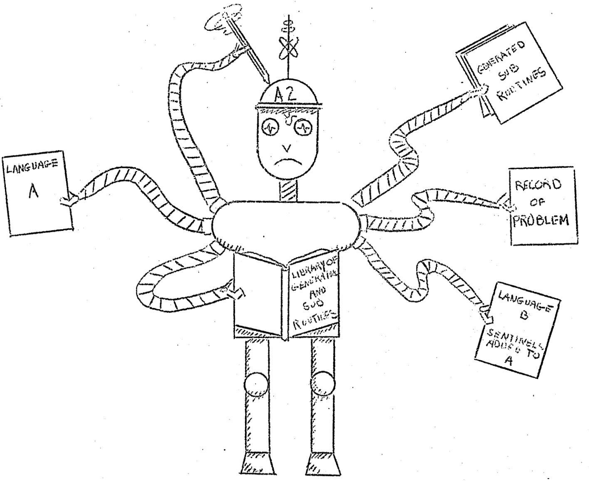

# Machines within Machines: Compilers

In 1954, computers just computed numbers. Grace Hopper, a famous
female programmer around then, had a hard time to convince her
colleagues that these machines can do more.

The picture to the left is from her, showing how a computer program
can produce another computer program. She even coined the term that is
still use today: a compiler.

Nowadays we have many more of these translation and transformation
machines, with names as funny as the picture: cross-compilers,
transpilers and compiler-compilers (cocos).

## Author
cft, 2019-04-10
