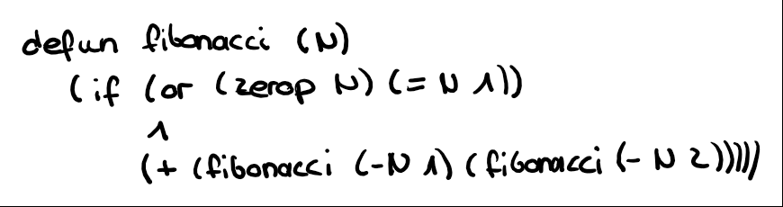

# LISP (List processor)

Computer are programmed using programming languages. Over the last six decades, thousands of different programming languages have been created. 
Among all these languages, there is one that stands out. This language is called Lisp and was created in 1958. Ironically, despite being one of the oldest languages still actively taught and used today, it represents very much the modern view of programming. 

The reason for this timelessness and sustained popularity is its conceptual simplicity and beauty. Its core definition is so small, that you could easily write it on a postcard - yet from this simple definition springs all of computer science. 
It has therefore been described as Maxwell's equations of computer science.

An important concept, which note only gave LISP its name, but also greatly contributes to its conceptual simplicity is that both program and data are represented as lists. This mean that any program can be treated as data and data can be programs.
This uniform representation makes it possible to write programs, which manipulate themselves while they are running. This gives enormous power to the programmer. 
The price to pay for this is that programs look slightly awkward and are full of parenthesis.  Critics have therefore said that the acronym Lisp stands for "Lots of superfluous and irritating parenthesis" and for this reason shy away from using LISP.

