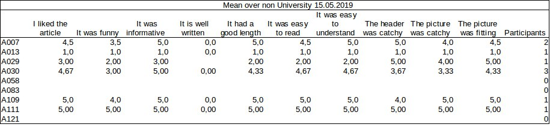

#Testresults (15.05.2019)

Here the results of the testing till 15.05.2019 are shown. It is always the mean over all participants per article. 
Red marks the articles with less than ten participants. Since the new category "well written" was included some days ago, the results of this category are not representative, yet.

 
This is not our target group:

